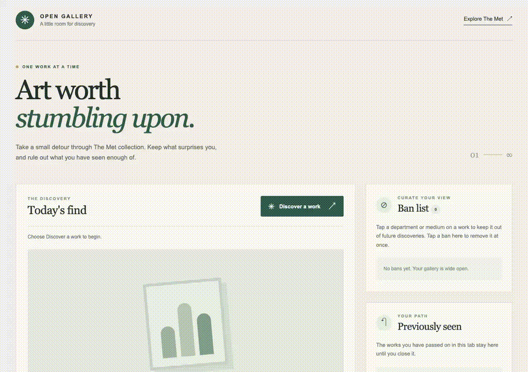

# Web Development Project 4 - Open Gallery

Submitted by **Yudhiishbala Senthilkumar**

This web app lets visitors discover one work at a time from The Metropolitan Museum of Art. Visitors can exclude departments or materials they do not want to see and revisit works from the current session.

Time spent **2 hours** in total

## Required Features

The following **required** functionality is completed.

- [x] **A button makes a new API request and displays an image and at least three attributes from the returned artwork.** Each result shows its title, date, department, medium, and artist when available.
- [x] **Only one current result is displayed at a time.** The image and attributes come from the same artwork record.
- [x] **Results appear random.** Each discovery searches a randomly chosen part of The Met collection and selects from a shuffled set of results.
- [x] **Clicking a displayed attribute adds it to the ban list.** Department and medium values can be banned. Clicking a ban removes it immediately.
- [x] **Banned attributes are excluded from later results.** Candidate works are checked against the current ban list before they are displayed.
- [x] **The walkthrough shows a ban being removed immediately.**

The following **optional** features are implemented.

- [x] Multiple attribute types can be added to the ban list.
- [x] A dedicated history section shows earlier works from the current session with their images and details.

The following **additional** features are implemented.

- [x] The ban list and viewing history stay available after a page refresh in the same browser tab.
- [x] Artwork with a missing or broken image is skipped.
- [x] Status messages explain when the collection cannot be reached or no eligible work is found.
- [x] The layout adapts to narrow screens and supports keyboard interaction.

## Video Walkthrough

The walkthrough shows a discovery, a department added to the ban list, another discovery, the ban removed, and the viewing history.

GIF created with Playwright and FFmpeg.

## Run Locally

From this folder, run `python3 -m http.server 4173` and open `http://localhost:4173`.

Run `npm test` to check the discovery rules and browser behavior. The app uses The Met Collection API and does not need an API key.

## Notes

Some collection records have no usable image. The discovery loop skips those records and keeps searching. When many values are banned, finding an eligible work can take longer and repeats may be more likely.

## License

Copyright 2026 Yudhiishbala Senthilkumar

Licensed under the Apache License, Version 2.0 (the "License");
you may not use this file except in compliance with the License.
You may obtain a copy of the License at

http://www.apache.org/licenses/LICENSE-2.0

Unless required by applicable law or agreed to in writing, software
distributed under the License is distributed on an "AS IS" BASIS,
WITHOUT WARRANTIES OR CONDITIONS OF ANY KIND, either express or implied.
See the License for the specific language governing permissions and
limitations under the License.
